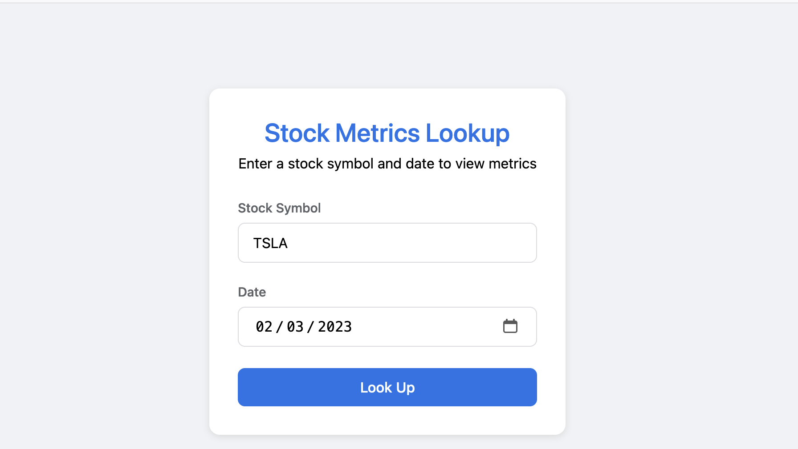
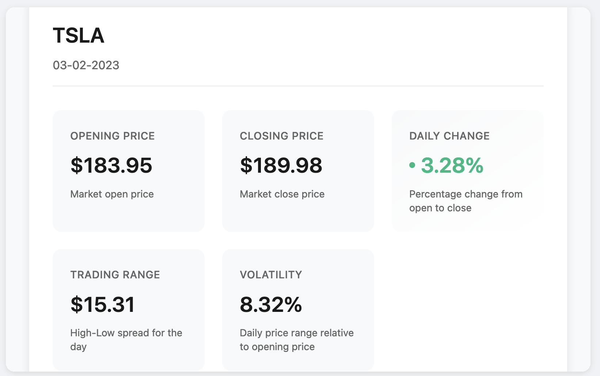
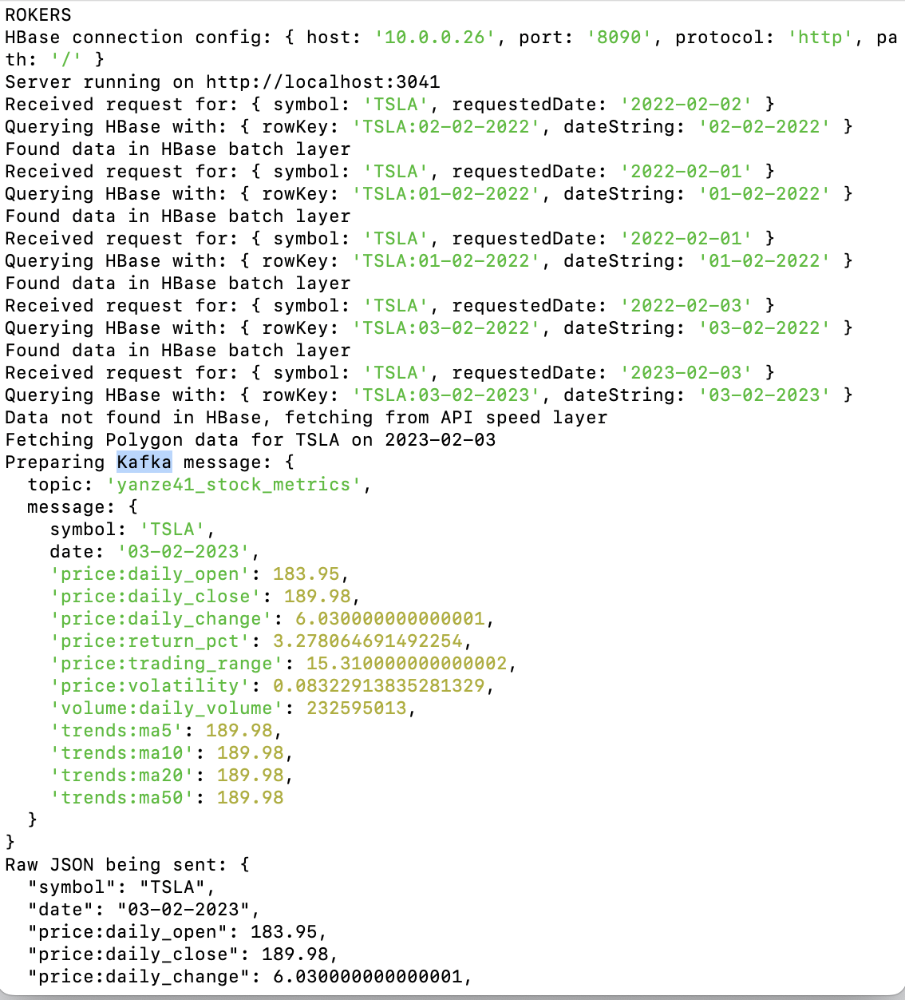

# Stock Analysis System

This project implements a Lambda architecture for stock data analysis, combining batch processing of historical data with real-time processing of current market data.

## System Architecture

### Batch Layer
- **Data Source**: Historical stock data from 1999-2022
- **Storage**: Apache Hive for data warehousing
- **Processing**: 
  1. Raw stock data imported into Hive tables
  2. Stock metrics calculated and stored in a dedicated metrics table
  3. Data mapped to HBase for quick access

### Speed Layer
- **Data Source**: Real-time stock data from Polygon API (post-2022)
- **Processing**:
  1. Real-time data fetched based on user queries
  2. Data processed through Kafka messaging system
  3. StreamStocks consumer processes messages and updates HBase

### Serving Layer
- Node.js frontend application
- Allows users to query stock metrics by symbol and date
- Automatically routes to batch or speed layer based on date

## Setup and Running Instructions

### Frontend Application
1. SSH into the cluster:
```bash
ssh -i /Users/jasonze/.ssh/id_ed25519 -C2qTnNf -D 9876 sshuser@hbase-mpcs53014-2024-ssh.azurehdinsight.net
```

2. Navigate to the application directory:
```bash
cd home/sshuser/yanze41/app3
```

3. Install dependencies and start the server:
```bash
npm install
node app.js 3041 http://10.0.0.26:8090 $KAFKABROKERS
```

### Kafka Consumer (Speed Layer)
1. SSH into the cluster (use the same command as above)

2. Navigate to the target directory:
```bash
cd home/sshuser/yanze41/target
```

3. Submit the Spark job:
```bash
spark-submit \
  --driver-java-options "-Dlog4j.configuration=file:///home/sshuser/ss.log4j.properties" \
  --class StreamStocks \
  uber-speedLayerKafka-1.0-SNAPSHOT.jar \
  $KAFKABROKERS
```

## Usage
1. Access the web interface
2. Enter a stock symbol (e.g., AAPL, GOOGL)
3. Select a date:
   - For dates between 1999-2022: Data served from batch layer (HBase)
   - For dates after 2022: Real-time data fetched from Polygon API through speed layer

## Architecture Flow
1. User submits query through frontend
2. System checks date:
   - Historical data: Retrieved directly from HBase
   - Recent data: Fetched from Polygon API, processed through Kafka, and stored in HBase
3. Results displayed to user with calculated metrics

## Screenshots



